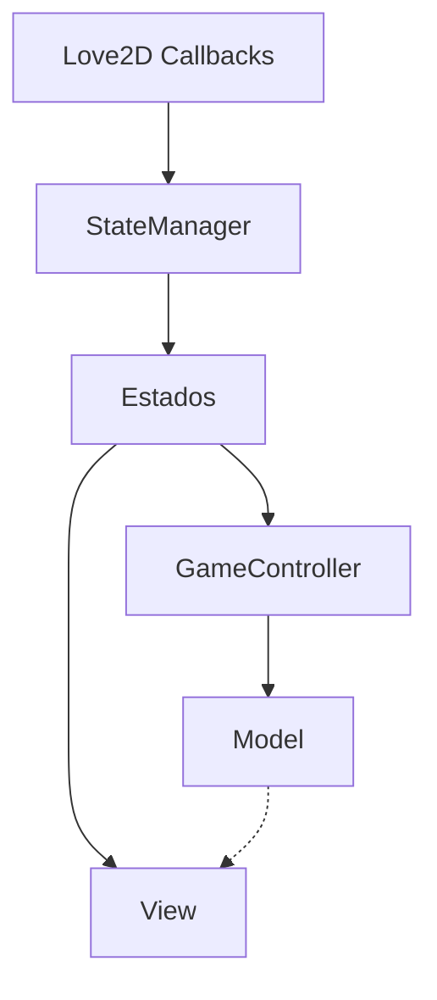

# Arquitetura

O sistema segue o padrão **MVC (Model-View-Controller)** para garantir a separação de responsabilidades. O gerenciamento de tela é feito através de um **State Manager**.

## Camadas

### 1. Model (Camada de Dados)
Responsável pelas regras de negócio puras e manipulação de estado.
- `src/models/board.lua`: Representação da matriz de jogo e regras de posicionamento/tiro.
- `src/models/ship.lua`: Representação de entidades de navios.

### 2. View (Camada de Apresentação)
Responsável pela renderização dos dados e captura de eventos de interface.
- `src/views/board_view.lua`: Renderiza o tabuleiro e trata a visibilidade baseada em névoa.

### 3. Controller (Camada de Lógica de Controle)
Coordena as interações entre Model e View.
- `src/controllers/game_controller.lua`: Gerencia turnos, processamento de disparos, IA e eventos.

## Princípios Adotados
- **SOLID**: Princípios de responsabilidade única aplicados (Controllers não desenham, Models não manipulam View).
- **Strategy Pattern**: Utilizado em `src/services/` para IA e Armas Especiais, permitindo extensibilidade sem alterar classes existentes.

