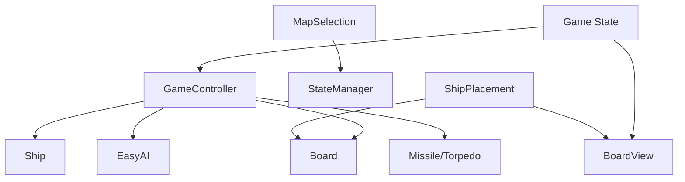

# Pontos de Extensão

O sistema foi desenhado para facilitar a adição de novas funcionalidades através de padrões de projeto estabelecidos.

## 1. Novas Armas
Para adicionar uma nova arma:
1. Criar novo arquivo em `src/services/weapons/`.
2. Implementar a interface `fire(board, x, y)`.
3. Registrar no `GameController:fire_weapon`.
4. Adicionar botão na `GameView`.

## 2. Novos Eventos
Para adicionar novos eventos (além de Névoa e Mar Agitado):
1. Atualizar `GameController:process_shot` para incluir a lógica de sorteio.
2. Definir o novo efeito no `GameController` ou nos Models/Views afetados.

## 3. Novos Mapas
- Adicionar configuração em `src/states/map_selection.lua` na tabela `maps`.
- A arquitetura já suporta dinamicamente tamanhos e frotas diferentes.

---

# Dependências (Dependency Map)

