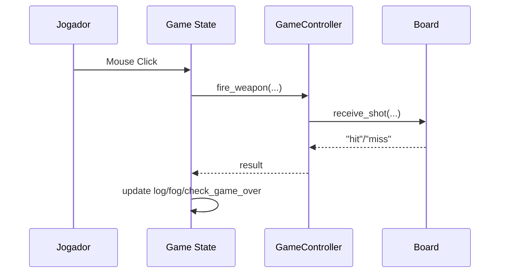

# Guia de Módulos

## Módulos e Responsabilidades

| Módulo | Responsabilidade |
| :--- | :--- |
| `src/core/state_manager.lua` | Gerencia transições entre estados de tela. |
| `src/models/board.lua` | Representação e regras da matriz de jogo. |
| `src/models/ship.lua` | Representação e estado de embarcações. |
| `src/controllers/game_controller.lua` | Orquestração da lógica de jogo, turnos, IA, armas e persistência. |
| `src/views/board_view.lua` | Renderização do tabuleiro e fog-of-war. |
| `src/services/ai/easy_ai.lua` | Estratégia de IA aleatória. |
| `src/services/weapons/` | Estratégias de armas especiais (Missile, Torpedo). |
| `src/database/db_manager.lua` | Operações SQLite (Ranking). |

---

# Diagrama de Sequência: Turno do Jogador

